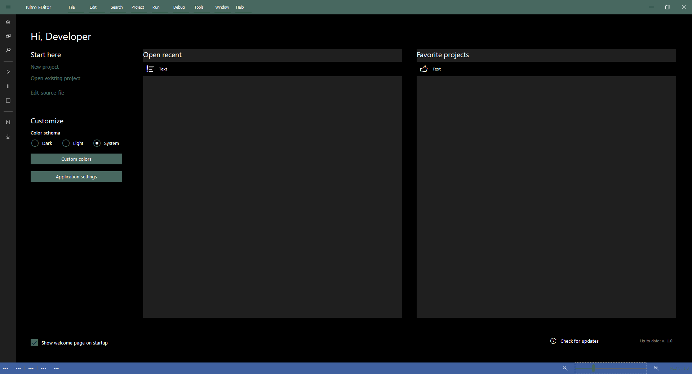
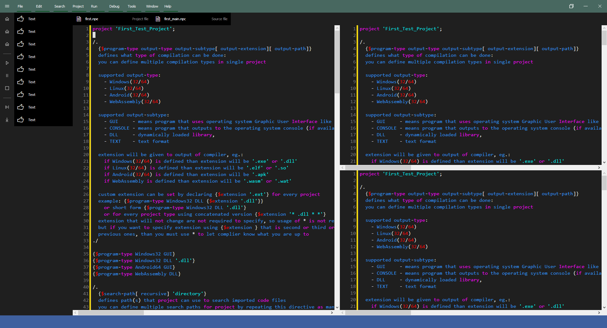
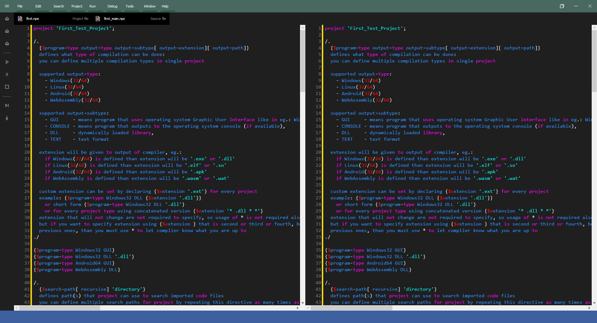

# NED - Nitro EDitor

Nitro EDitor for Nitro Pascal programming language.

---

NED project uses this components:
 - UniversalCL from: https://github.com/gmnevton/UniversalCL,
 - SynEdit from: https://github.com/TurboPack/SynEdit/releases/tag/102Tokyo

