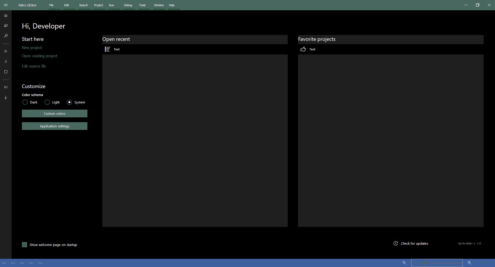
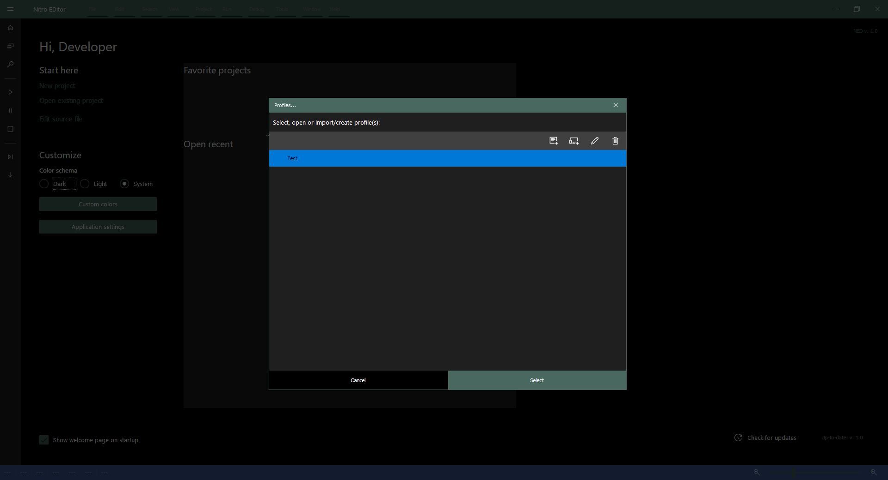
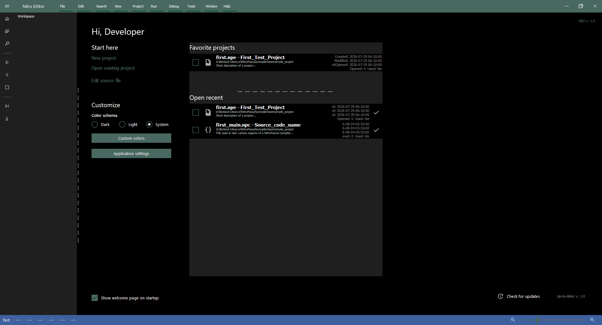
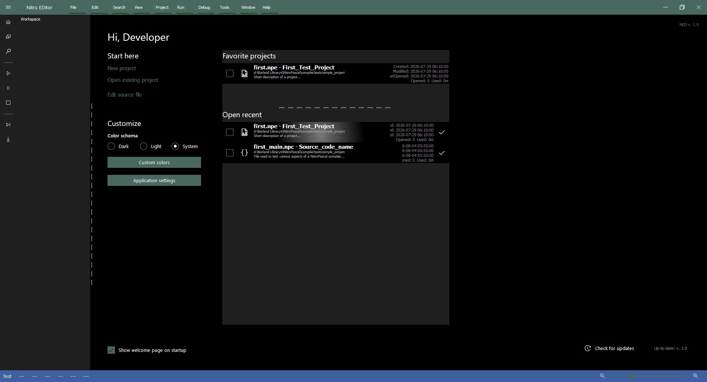
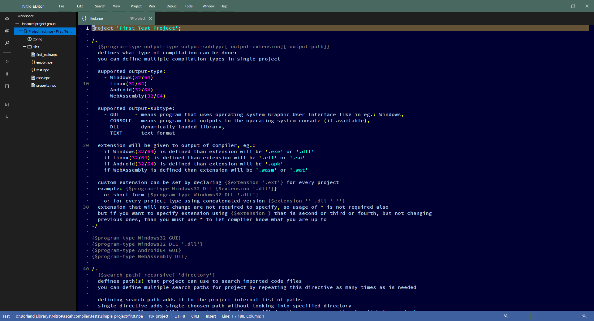
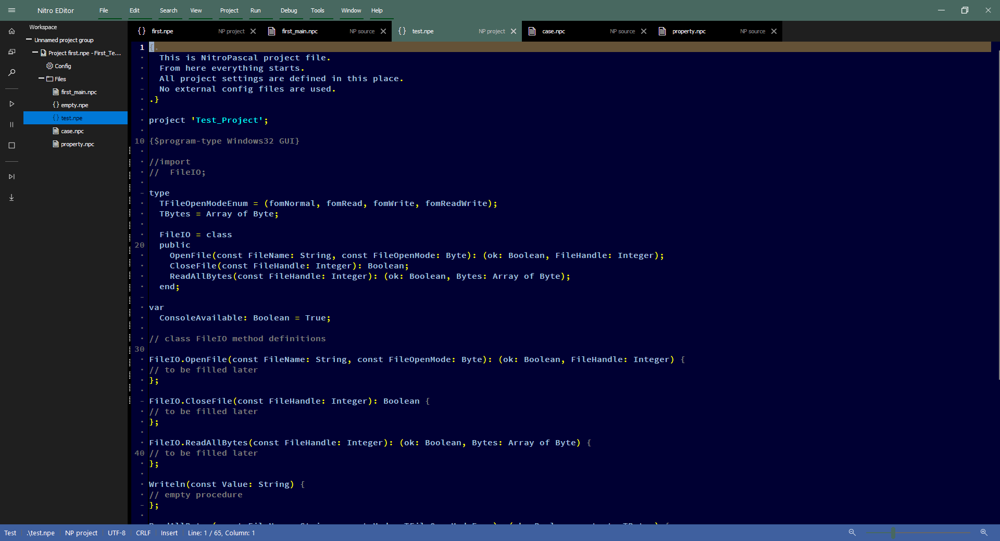
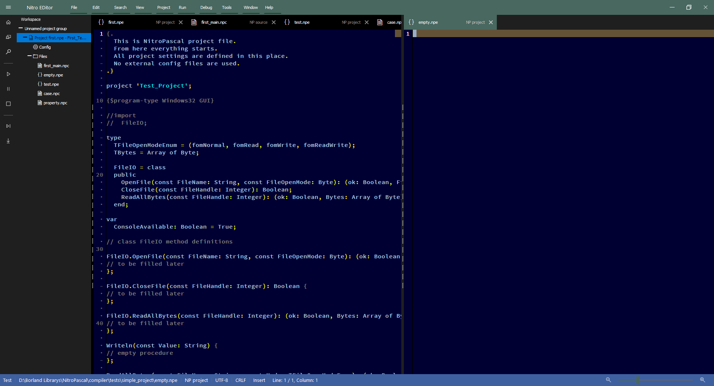
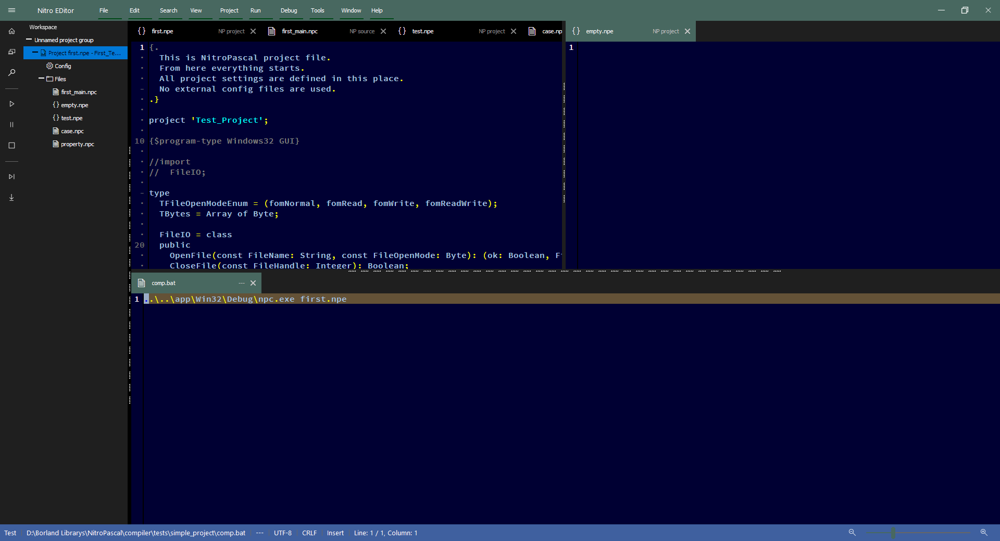

# NED - Nitro EDitor

Nitro EDitor for Nitro Pascal programming language.

Developing live streamed on YouTube: https://www.youtube.com/@gmnevton/streams

---

NED project uses this components:

- UniversalCL from: https://github.com/gmnevton/UniversalCL,

- ~~SynEdit from: https://github.com/TurboPack/SynEdit/releases/tag/102Tokyo~~

- Code editor made from scratch, by hand:
  
  - dual architecture:
    
    - document buffer,
    - visual view component
    
    buffer and view are separate,  
    one buffer <---> multiple independent views, listening for changes in buffer

---    

#### Screen shots

